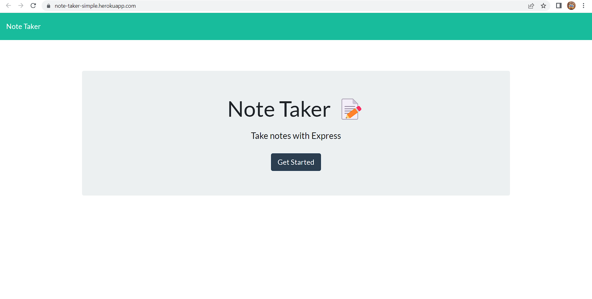
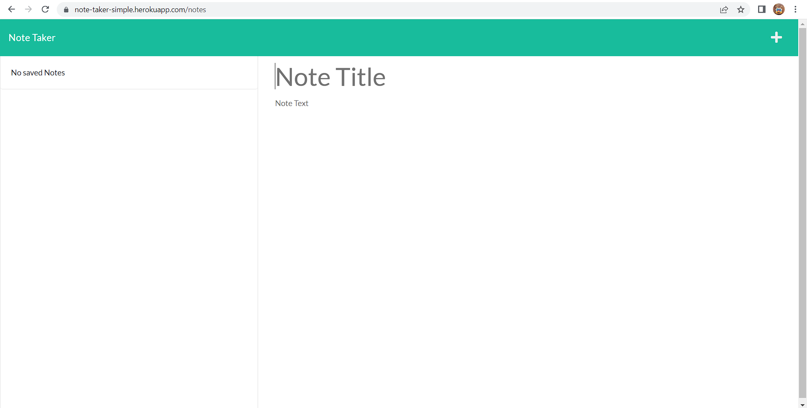

# Note-Taker
## Description
 This application is a simple note taker that can be used to write and save notes. This application uses an Express.js back end that can save and retrieve note data from a JSON file.

## User Story
```
AS A small business owner
I WANT to be able to write and save notes
SO THAT I can organize my thoughts and keep track of tasks I need to complete
```

## Visuals
What front page looks like


What page where notes are taken looks like


## Deployed link
https://note-taker-simple.herokuapp.com/